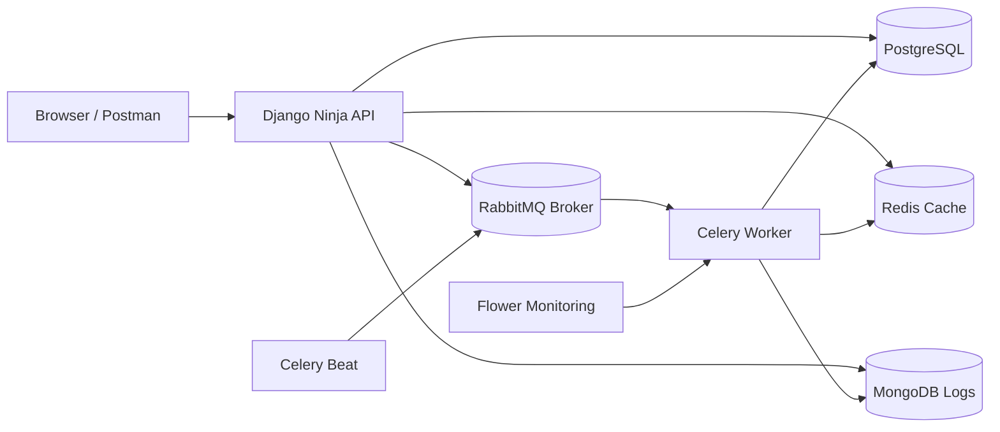
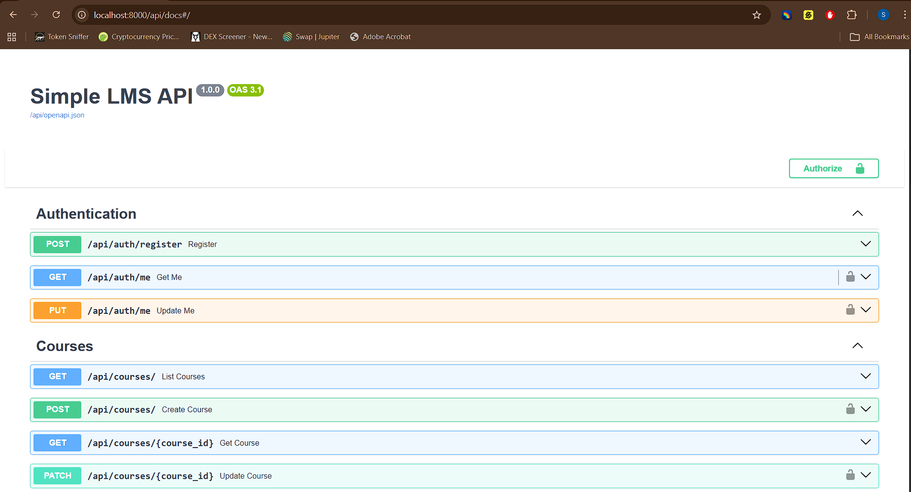
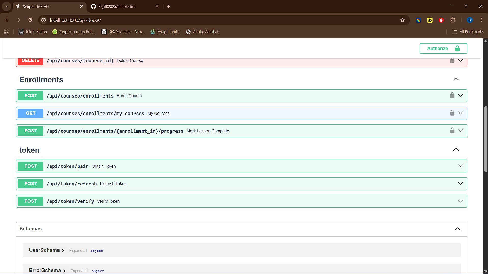
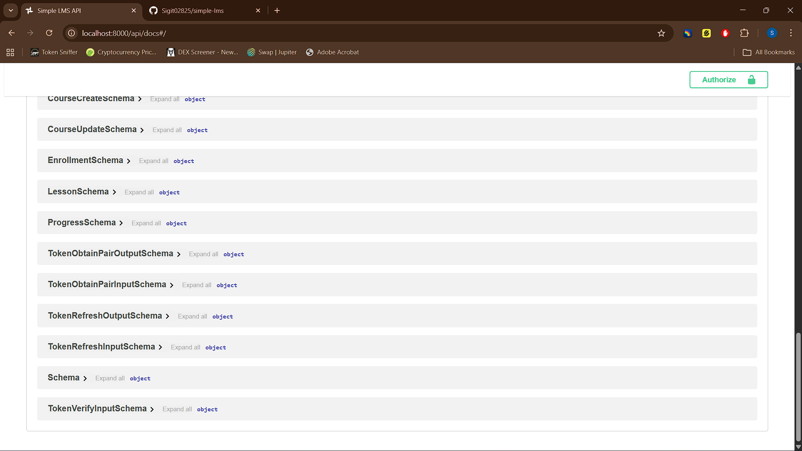

# Simple LMS

Backend Learning Management System berbasis **Django**, **Django Ninja**, **PostgreSQL**, **Redis**, **MongoDB**, **Celery**, **RabbitMQ**, dan **Docker Compose**. Project ini disusun bertahap mengikuti assignment per progres pada mata kuliah Pemrograman Sisi Server.

## Ringkasan Progres
### Progress 1
- Inisialisasi project Django.
- Containerisasi dasar dengan Docker.
- Setup service web dan database awal.

### Progress 2
- Implementasi model LMS dengan Django ORM.
- Konfigurasi Django Admin.
- Demo optimasi query dan profiling dengan Django Silk.

### Progress 3
- Implementasi REST API menggunakan Django Ninja.
- JWT authentication dan role-based authorization.
- Swagger UI dan Postman collection.

### Progress 4
- Redis caching untuk course list dan course detail.
- Rate limiting `60 requests/minute`.
- MongoDB untuk `activity_logs` dan `learning_analytics`.
- Celery task dengan RabbitMQ dan Flower monitoring.
- Export report async, enrollment email, certificate generation, dan scheduled statistics update.

## Assignment Commits
| Progress | Commit | Keterangan |
|---|---|---|
| Progress 1 | `da3a3eb` | Initial commit simple LMS with Docker |
| Progress 2 | `f9f42d8` | Data models, admin optimization, dan query demo |
| Progress 3 | `cf6b03c` | REST API dengan Django Ninja, JWT, dan RBAC |
| Progress 4 | `1e934fa` | Redis, MongoDB, Celery, RabbitMQ, Flower, dan dokumentasi |
| Redis Caching Exercise | `c94c616` | Implementasi caching weather API dengan Redis |

## Teknologi
- Python 3.11
- Django `<5.1`
- Django Ninja
- Django Ninja JWT
- PostgreSQL
- Redis
- MongoDB
- Celery
- RabbitMQ
- Flower
- Django Silk
- Docker Compose

## Arsitektur


## Fitur Utama
### Progress 2: ORM dan Admin
- Model `Course`, `CourseMember`, `CourseContent`, dan `Comment`.
- Relasi `ForeignKey` dan self-referencing content tree.
- Django Admin dengan `list_display`, `list_filter`, `search_fields`, dan ordering.
- Demo N+1 dan optimasi query di `query_optimization_demo.py`.
- Dashboard profiling di `/silk/`.

### Progress 3: REST API
- `POST /api/auth/register`
- `POST /api/token/pair`
- `POST /api/token/refresh`
- `GET /api/auth/me`
- `PUT /api/auth/me`
- `GET /api/courses/`
- `GET /api/courses/{course_id}`
- `POST /api/courses/`
- `PATCH /api/courses/{course_id}`
- `DELETE /api/courses/{course_id}`

### Progress 4: Advanced Features
- `POST /api/courses/{course_id}/enroll`
- `POST /api/courses/{course_id}/complete`
- `GET /api/courses/{course_id}/analytics`
- `POST /api/courses/{course_id}/export-report`
- Course list caching.
- Course detail caching.
- Cache invalidation saat create, update, delete, enroll, dan complete.
- MongoDB activity log dan learning analytics.
- Celery async task dan periodic task.

## Caching Strategy
### Redis Keys
- `courses:list:v1`
- `courses:detail:{course_id}:v1`
- `rate-limit:{scope}:{ip}`

### Cache Rules
- `GET /api/courses/` disimpan di Redis selama `CACHE_TTL_COURSE_LIST`.
- `GET /api/courses/{id}` disimpan di Redis selama `CACHE_TTL_COURSE_DETAIL`.
- Cache list dan detail dihapus saat ada perubahan data course.

### Rate Limiting
- Limit: `60 request / 60 detik`
- Backend: Redis cache
- Scope aktif pada endpoint course list dan course detail.

## MongoDB Collections
### `activity_logs`
- Menyimpan aktivitas seperti `course_created`, `course_updated`, `course_enrolled`, `course_completed`, `course_report_requested`, dan `certificate_generated`.

### `learning_analytics`
- Menyimpan event pembelajaran untuk kebutuhan reporting dan ringkasan aktivitas.

### Aggregation Query
- Endpoint `GET /api/courses/{course_id}/analytics` menjalankan aggregation MongoDB untuk:
- total event
- breakdown per action
- jumlah user unik

## Celery Tasks
### Async Tasks
- `send_enrollment_email`
- `generate_certificate`
- `update_course_statistics`
- `export_course_report`

### Task Flow
```text
Student enroll -> API membuat CourseMember -> Celery kirim email -> MongoDB log activity
Student complete course -> API update completed_at -> Celery generate certificate
Instructor export report -> API kirim task -> Celery generate CSV report
Celery Beat schedule -> update_course_statistics -> update enrollment_count/completion_count
```

## Docker Compose Services
- `web` : Django app
- `db` : PostgreSQL
- `redis` : Redis cache dan Celery result backend
- `mongodb` : Activity log dan analytics
- `rabbitmq` : Message broker
- `celery-worker` : Celery worker
- `celery-beat` : Scheduler
- `flower` : Monitoring Celery

## Monitoring
### Swagger dan Admin
- API Docs: `http://localhost:8000/api/docs`
- Admin: `http://localhost:8000/admin/`
- Silk: `http://localhost:8000/silk/`
- Flower: `http://localhost:5555/`
- RabbitMQ Management: `http://localhost:15672/`

### Redis CLI Commands
```bash
docker compose exec redis redis-cli
KEYS *
GET courses:list:v1
TTL courses:list:v1
```

## Cara Menjalankan
### 1. Clone repository
```bash
git clone https://github.com/Sigit02825/simple-lms.git
cd simple-lms
```

### 2. Copy environment
```bash
copy .env.example .env
```

### 3. Start semua service
```bash
docker compose up --build -d
```

### 4. Migrasi dan seed data
```bash
docker compose exec web python manage.py migrate
docker compose exec web python seed_db.py
```

### 5. Jalankan monitoring
- Flower otomatis tersedia di `http://localhost:5555/`
- RabbitMQ management tersedia di `http://localhost:15672/`

## Akun Default
- Admin: `admin / admin123`
- Instructor: `instructor1 / pass123`
- Student: `student1 / pass123`

## Screenshots
### Swagger UI


### Django Admin


### API Testing


## Struktur Project
```text
simple-lms/
├── config/
│   ├── api.py
│   ├── celery.py
│   ├── settings.py
│   └── urls.py
├── courses/
│   ├── admin.py
│   ├── api.py
│   ├── models.py
│   ├── permissions.py
│   ├── schemas.py
│   ├── services.py
│   └── tasks.py
├── users/
│   ├── api.py
│   ├── models.py
│   └── schemas.py
├── images/
├── docker-compose.yml
├── Dockerfile
├── LMS_Postman_Collection.json
├── query_optimization_demo.py
├── requirements.txt
├── seed_db.py
└── README.md
```

## Author
- Nama: Sigit Ilham
- Mata Kuliah: Pemrograman Sisi Server
- Status: Progress 1, 2, 3, dan 4 terdokumentasi di repository ini
